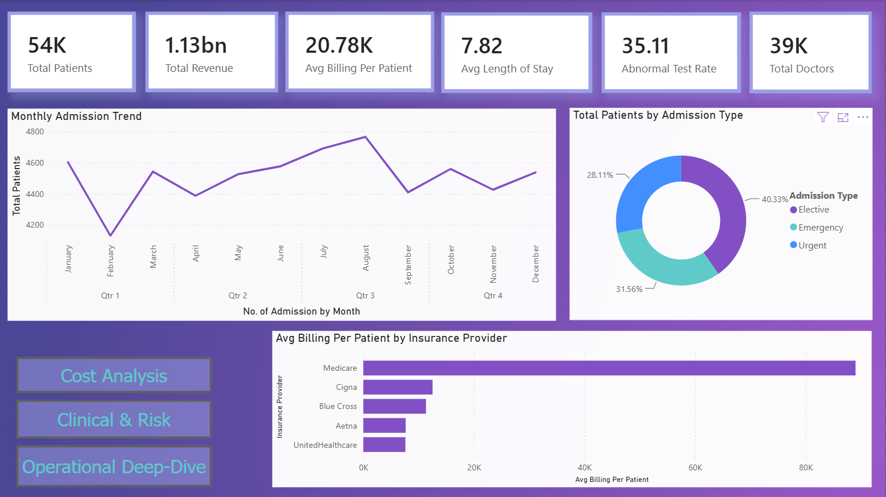
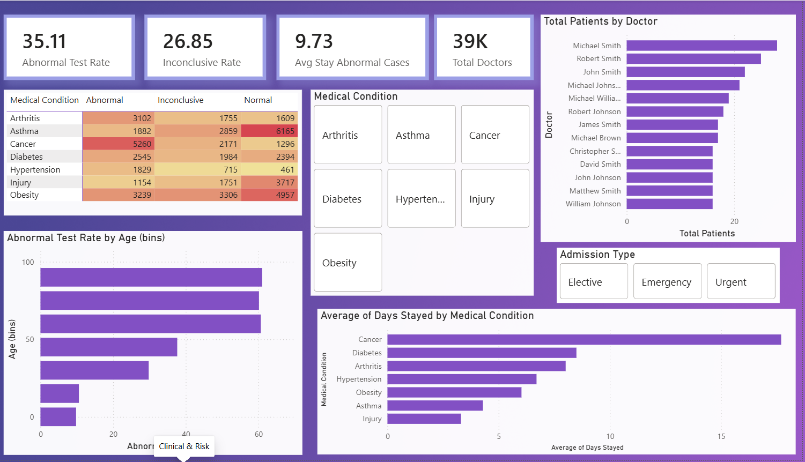
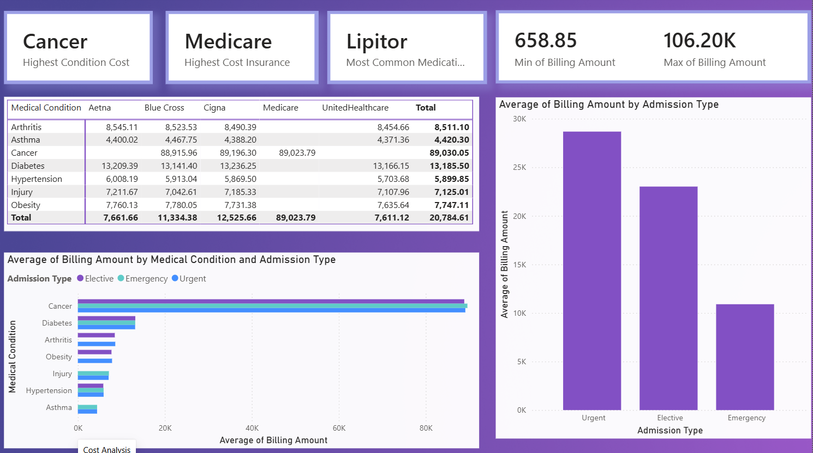
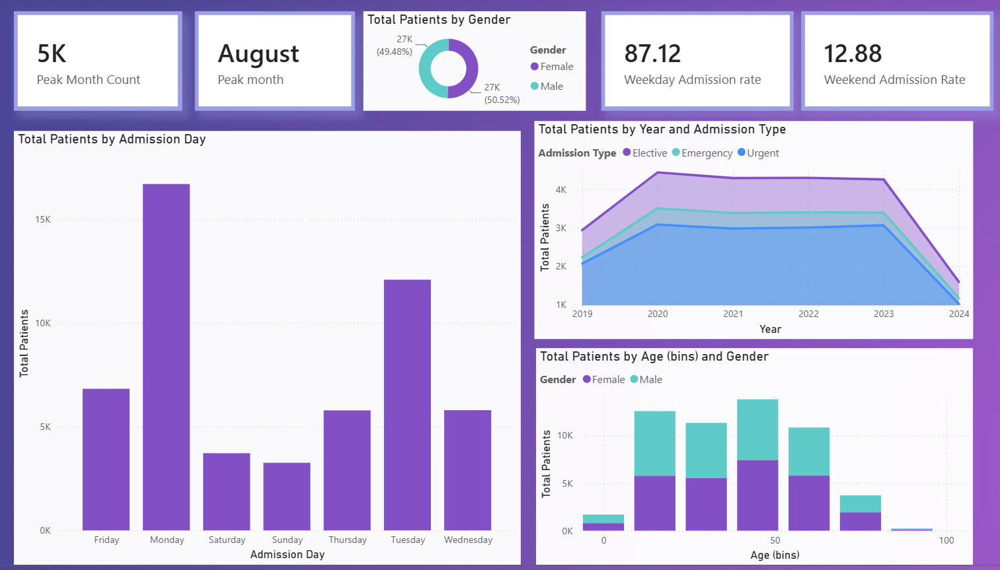

# 🏥 Healthcare Patient Analytics Dashboard

End-to-end data analytics project on hospital patient records — from raw data cleaning in Python to an interactive 4-page Power BI dashboard for hospital administrators.

📄 Full analysis and findings: [reports/FINDINGS.md](reports/FINDINGS.md)

## Problem Statement

Hospital administrators often lack visibility into what drives patient costs, which conditions carry the highest clinical risk, and how admission patterns vary over time. This project analyzes 54,151 patient records to surface actionable insights for cost management, risk monitoring, and operational planning.

## A note on the dataset

The base dataset is the [Healthcare Dataset on Kaggle](https://www.kaggle.com/datasets/prasad22/healthcare-dataset) — fully synthetic, randomly generated data. In its original form, billing amounts and other fields were assigned independently of medical condition, so there were no real relationships to analyze (e.g. average billing was nearly flat across every condition).

To make the dataset usable for an actual cost/risk analysis, I edited it to introduce realistic structure — for example, billing amount and length of stay now scale with medical condition severity, and insurance provider coverage patterns vary by condition rather than being uniformly random. The cleaning and EDA process (notebooks `1`–`3`) was then run on this edited version exactly as it would be on real hospital data. This is disclosed here so the findings are read in the right context — they demonstrate the analysis technique end-to-end, not a real hospital's actual cost structure.

## Key Findings

- **Cancer patients cost ~7–20x more than any other condition** — average billing of $89,030 vs $4,420–$13,186 for every other condition. This is the single biggest cost driver in the dataset.
- **Length of stay is the strongest driver of cost** — Billing Amount and Days Stayed correlate at 0.92, the strongest relationship found anywhere in the data. Condition determines stay length, and stay length determines cost.
- **Medicare's high average billing ($89,024) is a downstream effect of Cancer, not insurer pricing** — cross-checking the Medical Condition × Insurance Provider breakdown shows all insurers charge nearly the same for Cancer cases; Medicare's overall average is high simply because its patient base skews heavily toward Cancer.
- **Admission Type drives a real difference in length of stay** — Urgent admissions average 9.14 days vs Emergency's 5.32 days, a 72% gap, and Urgent stays are also the least predictable (widest spread).
- **35.1% of all test results came back Abnormal**, with Cancer (5,260 cases) carrying the highest abnormal case volume of any condition.
- **Monday is the busiest admission day** (~18K patients) versus weekend days (~5K), with 87.1% of all admissions falling on weekdays.
- Patient admissions **peak in August** (4,765 cases), the highest of any calendar month.

## Tech Stack

| Tool | Purpose |
|---|---|
| Python (Pandas, NumPy) | Data cleaning, feature engineering |
| Matplotlib & Seaborn | Exploratory data analysis & visualization |
| Power BI / DAX | Interactive 4-page dashboard |

## Data Cleaning Highlights

Real-world-style data quality issues were resolved through a structured pipeline:
- Negative Billing Amount values — removed (not assumed to be sign-flip errors; see [FINDINGS.md](reports/FINDINGS.md) for reasoning)
- Discharge dates earlier than admission dates — removed as invalid records
- Negative or unrealistic Age values (>110) — removed
- Duplicate rows — removed
- Inconsistent text casing across categorical columns — standardized with `.str.strip().str.title()`
- Billing outliers — removed using the IQR method, calculated **per medical condition** (not globally), since cost ranges differ drastically by diagnosis
- Engineered `Days Stayed` feature from admission/discharge dates

Full process documented in `notebooks/2_dataCleaning.ipynb`.

## Dashboard Preview

**Page 1 — Executive Summary**


**Page 2 — Clinical & Risk**


**Page 3 — Cost Analysis**


**Page 4 — Operational Deep-Dive**


## Project Structure

```
healthcare-analytics/
├── data/processed/             Cleaned (and edited) dataset
├── notebooks/
│   ├── 1_dataLoading.ipynb        Initial inspection
│   ├── 2_dataCleaning.ipynb       Cleaning & feature engineering
│   └── 3_eda_visualization.ipynb  EDA charts
├── dashboard/                  Power BI file + screenshots
└── reports/                    FINDINGS.md + EDA chart images
```

## How to Run

```bash
git clone https://github.com/YOUR_USERNAME/healthcare-analytics.git
cd healthcare-analytics
pip install -r requirements.txt
jupyter notebook
```

Run notebooks in order: `1_dataLoading.ipynb` → `2_dataCleaning.ipynb` → `3_eda_visualization.ipynb`

## Dataset

Source: [Healthcare Dataset — Kaggle](https://www.kaggle.com/datasets/prasad22/healthcare-dataset) (synthetic data, edited — see note above)

## Author

Himanshu Dansena— B.Tech Biotechnology, NIT Raipur

